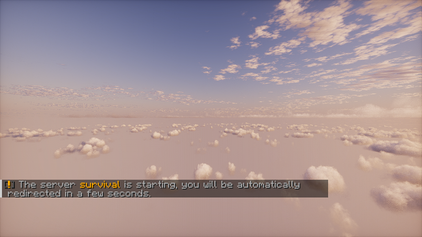

# PterodactylPowerAction

A resource-saving Velocity plugin that automatically manages your Minecraft servers by starting them on demand and
shutting them down when idle, using either the [Pterodactyl](https://pterodactyl.io/) API or shell commands.

---

## Community & Support

If you have any questions or suggestions, join the [Discord server](https://discord.gg/M2a9dxJPRy)!

## ✨ Key Features

- 🔌 **Energy & Resource Saving** - Automatically shuts down empty servers after a configurable idle period (default: 1
  hour)

- 🚀 **On-Demand Server Startup** - Starts servers only when players need them, optimizing resource usage

- 🔄 **Seamless Player Experience**:
    - Redirects players to a lightweight waiting server during startup
    - Automatically transfers players when their destination server is ready
    - Keeps players informed with status messages throughout the process

- 🛡️ **Kick Protection** - Optionally redirects kicked players to your waiting server instead of disconnecting them

- 🧰 **Flexible Implementation**:
    - Works with Pterodactyl Panel API for managed hosting
    - Supports direct shell commands for self-hosted environments

- ⚙️ **Highly Configurable**:
    - Customizable shutdown delay
    - Multiple server status checking methods
    - Configurable shutdown behavior on proxy restart

- 🌐 **Multilingual Support** - Automatically translates messages based on the client's language (English, German,
  French)

- 🔍 **Diagnostic Tools** - Built-in doctor command to validate your configuration and troubleshoot issues

## How it Works

When a player tries to connect to a stopped server, they're temporarily sent to your waiting server while
PterodactylPowerAction starts their requested destination. Once the server is ready, they're automatically transferred.
The plugin monitors player activity and intelligently shuts down empty servers to save resources.

  
_Shader is Photon._

---

## Documentation

### Configuration

The [configuration guide](docs/configuration.md) is available in this document.

### In-game Commands

The [commands guide](docs/commands.md) is available in this document.

---

## Waiting/Limbo servers

Here is a small list of recommended lightweights servers software to use as waiting server:

- [PicoLimbo](https://github.com/Quozul/PicoLimbo)
- [NanoLimbo](https://www.spigotmc.org/resources/86198/)
- [Limbo](https://www.spigotmc.org/resources/82468/)

Note that the waiting server does not have to be a limbo server specifically, it can be any server as long as it is
always accessible. If you have a dedicated lobby server in your network, you can use that, no need for a dedicated limbo
server!

## Motivations

I am running Minecraft servers on dedicated hardware at home, I wanted to save energy costs and memory usage by stopping
empty servers. Running the waiting server on a low power ARM Single Board Computer can also further save costs.

---

## Contributing

Contributions are welcome! If you encounter any issues or have suggestions for improvement, please submit an issue or
pull request on GitHub. Make sure to follow the existing code style and include relevant tests.

1. Fork the repository.
2. Create a new branch `git checkout -b <branch-name>`.
3. Make changes and commit `git commit -m 'Add some feature'`.
4. Push to your fork `git push origin <branch-name>`.
5. Submit a pull request.
